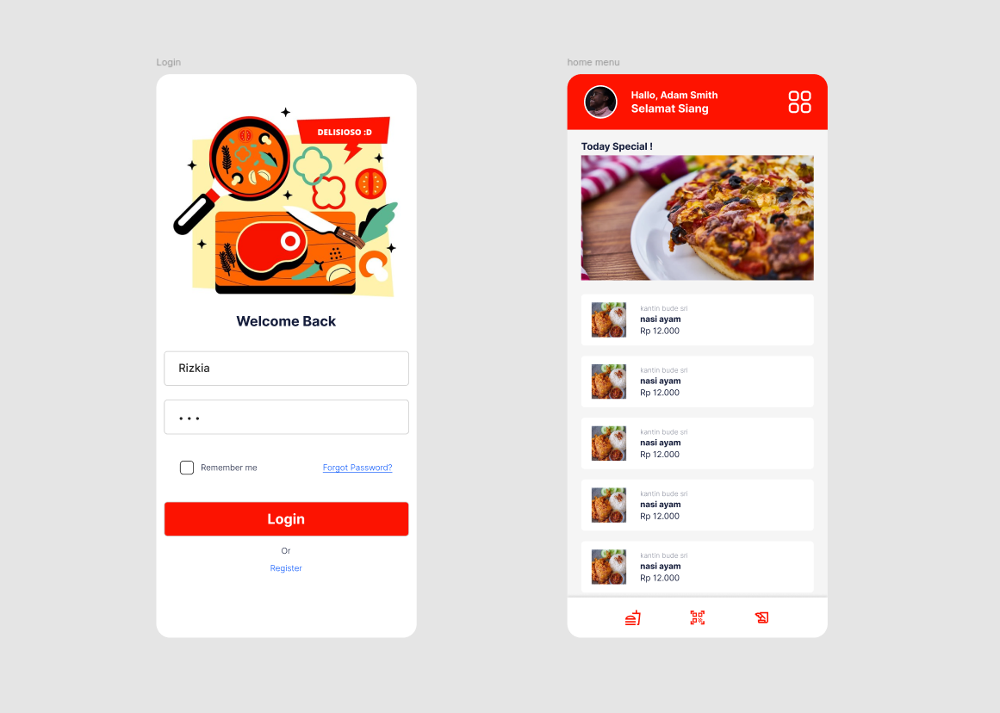
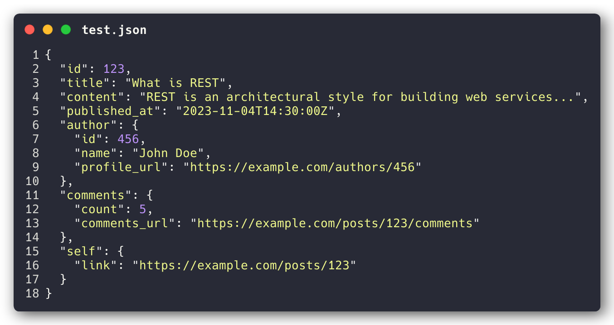
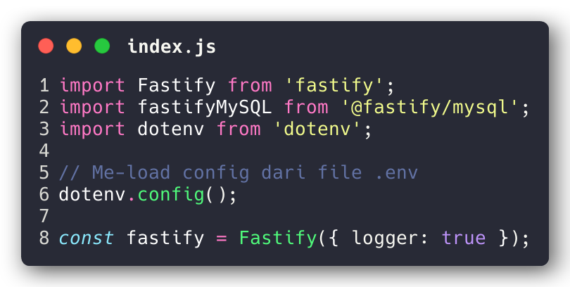
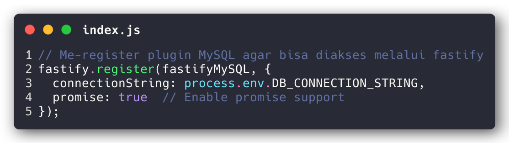
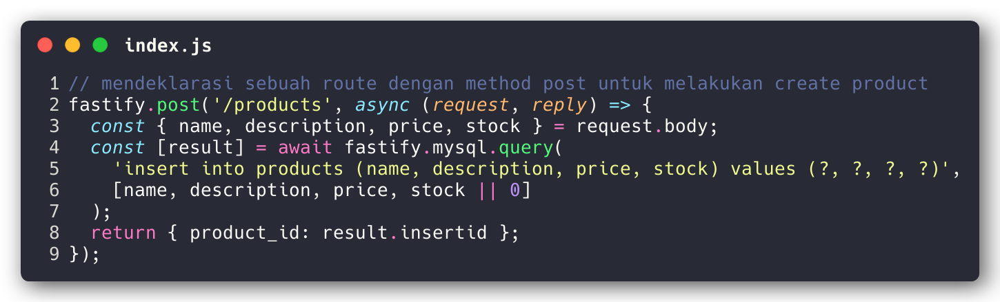

# Table of Contents

1. [FIGMA](#figma)
2. [REST](#rest)
   1. [Enam Prinsip Panduan REST](#i-enam-prinsip-panduan-rest)
      - [Uniform Interface](#1-uniform-interface)
      - [Client-Server](#2-client-server)
      - [Stateless](#3-stateless)
      - [Cacheable](#4-cacheable)
      - [Layered System](#5-layered-system)
      - [Code on Demand (Optional)](#6-code-on-demand-optional)
   2. [Apa Itu Sumber Daya?](#ii-apa-itu-sumber-daya)
      - [Identifikasi resources](#1-identifikasi-resources)
      - [Hypermedia](#2-hypermedia)
      - [Self-Descriptive](#3-self-descriptive)
      - [Example](#4-example)
   3. [Resource Methods](#iii-resource-methods)
   4. [REST and HTTP are Not the Same](#iv-rest-and-http-are-not-the-same)
   5. [Summary](#v-summary)
3. [CRUD API](#crud-api)
   1. [Setup](#setup)
   2. [Penjelasan Kode](#penjelasan-kode)
   3. [CURL](#curl)
      - [Create Product](#1-create-product)
      - [Read All Products](#2-read-all-products)
      - [Read Single Product by ID](#3-read-single-product-by-id)
      - [Update Product by ID](#4-update-product-by-id)
      - [Delete Product by ID](#5-delete-product-by-id)
   4. [Source Code](#source-code)
   5. [Referensi](#referensi)

# FIGMA
Berikut adalah desain figma dari tugas minggu sebelumnya.

<div style="text-align: center;">
    
</div>

# REST

REST, (REpresentational State Transfer), adalah *architectural style* *untuk distributed hypermedia systems*. Diperkenalkan pertama kali oleh Roy Fielding pada tahun 2000 dalam disertasinya, REST telah menjadi salah satu *architectural style* paling umum dalam *development* API berbasis web.

REST bukanlah protokol atau standar, melainkan *architectural style*. Selama *development*, developer API dapat menerapkan REST dengan berbagai cara.

Seperti *architectural style* lainnya, REST memiliki prinsip dan *constraints*. Prinsip-prinsip ini harus dipenuhi agar *service interface* dapat disebut RESTful.

### I. Enam Prinsip Panduan REST
------------
REST didasarkan pada sejumlah *constraints*. dan prinsip yang mendukung kesederhanaan, skalabilitas, dan statelessness dalam desainnya. Enam prinsip atau *constraints*. utama dalam arsitektur RESTful adalah:

##### 1. Uniform Interface
*Uniform interface* memungkinkan *interface* yang konsisten untuk interaksi antara klien dan server. Prinsip ini mencakup empat *constraints*:
-  **Identification of resources** – Setiap *resources* harus memiliki identitas unik dalam interaksi klien dan server.
- **Manipulation of resources through representations** – Representasi *resources* yang konsisten digunakan dalam respons server, memungkinkan klien mengubah status *resources*.
- **Self-descriptive messages** – Setiap representasi *resources* membawa informasi yang cukup untuk menjelaskan cara memproses pesan tersebut dan tindakan tambahan yang dapat dilakukan.
- **Hypermedia as the engine of application state** – Klien hanya memiliki URI awal aplikasi, dan seluruh interaksi didorong melalui *hyperlink*.

Dalam praktiknya, API REST berbasis HTTP menggunakan metode standar (GET, POST, PUT, DELETE, dll.) dan URI (Uniform Resource Identifier) untuk identifikasi *resources*.

##### 2. Client-Server
Desain client-server memisahkan *interface* pengguna (klien) dari *data storage* (server), yang meningkatkan portabilitas *interface* pengguna di berbagai platform serta skalabilitas server. Dengan demikian, klien dan server dapat berevolusi secara independen tanpa mengganggu kontrak *interface*.

##### 3.  Stateless
Prinsip statelessness mengharuskan setiap permintaan dari klien ke server mengandung semua informasi yang diperlukan. Server tidak menyimpan Context *session*, sehingga aplikasi klien harus menyimpan seluruh status *session*.

##### 4. Cacheable
Prinsip ini menyatakan bahwa respons harus secara eksplisit atau implisit menunjukkan apakah dapat di-cache. Jika respons dapat di-cache, klien dapat menggunakannya kembali untuk permintaan serupa dalam periode tertentu.

##### 5. Layered System
Sistem berlapis memungkinkan arsitektur disusun dalam lapisan hierarkis, di mana setiap komponen hanya berinteraksi dengan lapisan yang terdekat. Contohnya, pola MVC (Model-View-Controller) memisahkan berbagai *concerns*, membuat aplikasi lebih mudah dikembangkan, dikelola, dan diskalakan.

##### 6. Code on Demand (Optional)
REST memungkinkan fungsionalitas klien diperluas melalui *downloading and executing code* dalam bentuk seperti applet atau skrip. Hal ini menyederhanakan klien dengan mengurangi fitur yang perlu diimplementasikan sebelumnya, di mana server dapat menyediakan sebagian fitur yang akan dijalankan oleh klien.

### II. Apa Itu Sumber Daya?
------------
*The key abstraction of information in REST is a resource*. Setiap informasi yang dapat diberi nama bisa dianggap sebagai *resources*. Contohnya, *resources* REST bisa berupa dokumen, gambar, *a temporal service*, kumpulan *resources* lainnya, atau objek non-virtual (misalnya, *a person*).

Status dari *resources* pada waktu tertentu dikenal sebagai ***resource representation*** . *Resource representation* terdiri dari:

- **data**
- **metadata** yang menjelaskan tentang data itu sendiri
- **hypermedia links** that can help the clients transition to the next desired state.

> A REST API consists of an assembly of interlinked resources. This set of resources is known as the REST API’s resource model.

##### 1. Identifikasi *resources*
REST menggunakan *resource identifiers* untuk mengenali setiap *resources* yang terlibat dalam interaksi antara komponen klien dan server.

##### 2. Hypermedia
Format data dari representasi disebut sebagai **media type**. Media type mengidentifikasi spesifikasi yang mendefinisikan bagaimana representasi tersebut harus diproses.

API RESTful berfungsi seperti *hypertext*. Setiap unit informasi yang dapat diakses memiliki alamat, baik secara eksplisit (misalnya, atribut tautan dan ID) atau secara implisit (e.g., derived from the media type definition and representation structure).	.

> Hypertext (or hypermedia) means the simultaneous presentation of information and controls such that the information becomes the affordance through which the user (or automaton) obtains choices and selects actions.
> 
Remember that hypertext does not need to be HTML (or XML or JSON) on a browser. Machines can follow links when they understand the data format and relationship types.
> 
— Roy Fielding

##### 3. Self-Descriptive
Representasi *resources* juga harus **self-descriptive**: klien tidak perlu mengetahui apakah *resources* tersebut adalah *employee or a device*. Klien harus bertindak berdasarkan media type associated with the *resources*.

Dalam praktiknya, kita akan membuat banyak custom media types – biasanya satu media type terkait dengan satu *resources*. 

Setiap media type mendefinisikan sebuah *default processing model*. Sebagai contoh, HTML mendefinisikan proses rendering untuk hypertext dan *browser behavior around each element.*

##### 4. Example
Consider the following REST *resource* that represents a blog post with links to related resources in an HTTP-based REST API. This has the necessary information about the blog post, as well as the hypermedia links to the related resources such as author and comments. Clients can follow these links to discover additional information or perform actions.

<div style="padding-left:50px; padding-top:50px;">
    
</div>

### III. Resource Methods
------------
Hal penting lainnya yang terkait dengan REST adalah **resource methods**. These resource methods are used to perform the desired transition between two states of any resource.

Banyak orang secara keliru mengaitkan metode *resource methods* dengan metode HTTP (yaitu, GET/PUT/POST/DELETE). Roy Fielding tidak pernah memberikan rekomendasi tentang metode mana yang harus digunakan dalam kondisi tertentu. Yang ditekankannya adalah bahwa harus ada *uniform interface*.

Sebagai contoh, jika kita memutuskan bahwa API aplikasi akan menggunakan HTTP POST untuk memperbarui suatu *resource methods* —daripada yang banyak orang rekomendasikan, yaitu HTTP PUT—itu tidak masalah. *application interface* tetap dapat dianggap RESTful.

Ideally, everything needed to transition the resource state shall be part of the resource representation – including all the supported methods and what form they will leave the representation.

### IV. REST and HTTP are Not the Same
------------
Many people prefer to compare HTTP with REST. REST and HTTP are not the same.

> REST != HTTP

Though REST also intends to make the web (internet) more streamlined and standard, Roy Fielding advocates using REST principles more strictly. And that’s where people try to start comparing REST with the web.

Roy Fielding, in his dissertation, has nowhere mentioned any implementation direction – including any protocol preference or even HTTP. Till the time, we are honoring the six guiding principles of REST, which we can call our interface – RESTful.

### V. Summary
------------
In simple words, in the REST architectural style, data and functionality are considered resources and are accessed using Uniform Resource Identifiers (URIs).

The resources are acted upon by using a set of simple, well-defined operations. Also, the resources have to be decoupled from their representation so that clients can access the content in various formats, such as HTML, XML, plain text, PDF, JPEG, JSON, and others.

The clients and servers exchange representations of resources by using a standardized interface and protocol. Typically HTTP is the most used protocol, but REST does not mandate it.

Metadata about the resource is made available and used to control caching, detect transmission errors, negotiate the appropriate representation format, and perform authentication or access control.

And most importantly, every interaction with the server must be stateless.

All these principles help RESTful applications to be simple, lightweight, and fast.

# CRUD API
Disini saya akan membuat API untuk melakukan operasi CRUD untuk pengelolaan product. API ini saya buat dengan menggunakan framework JS yaitu fastify dan agar simpel databasenya saya gunakan MySQL.

### Setup
------------

Berikut adalah konfigurasi package.json pada project ini :

```json
{
  "name": "tes",
  "version": "1.0.0",
  "main": "index.js",
  "scripts": {
    "test": "echo \"Error: no test specified\" && exit 1",
    "start": "fastify start index.js"
  },
  "keywords": [],
  "author": "",
  "license": "ISC",
  "description": "",
  "type": "module",
  "dependencies": {
    "@fastify/mysql": "^5.0.1",
    "dotenv": "^16.4.5",
    "fastify": "^5.0.0",
    "fastify-cli": "^7.0.1"
  }
}
```
Untuk menginstall packages yang dibutuhkan, jalankan perintah berikut.
```bash
npm i
```
Environtment variables yang diperlukan :
```env
DB_CONNECTION_STRING
```
### Penjelasan Kode
------------
Melakukan import package lalu me-load environtment variables dari file .env.
<div style="padding-left:50px; padding-top:50px;">
    
</div>

Melakukan registrasi MySQL menggunakan plugin fastify.
<div style="padding-left:50px; padding-top:50px;">
    
</div>

Membuat sebuah route dengan method post untuk melakukan create product. saya juga berikan callback function untuk melakukan logic create product. logic yang ada pada callback tersebut seperti eksekusi db query lalu mengembalikan hasil querynya pada client melalui http response.

Melakukan registrasi MySQL menggunakan plugin fastify.
<div style="padding-left:50px; padding-top:50px;">
    
</div>

Penjelasan lebih lengkapnya bisa dilihat langsung pada source code.

### CURL
------------
##### 1. Create Product
###### request
```bash
curl -X POST http://localhost:3000/products \
-H "Content-Type: application/json" \
-d '{
  "name": "Sample Product",
  "description": "This is a sample product description",
  "price": 99.99,
  "stock": 50
} | jq'

```
###### response
```json
{
  "product_id": 6
}
```
##### 2. Read All Products 
###### request
```bash
curl -X GET http://localhost:3000/products | jq
```
###### response
```json
[
  {
    "product_id": 1,
    "name": "Sample Product",
    "description": "This is a sample product description",
    "price": "99.99",
    "stock": 50,
    "created_at": "2024-10-24T21:41:02.000Z",
    "updated_at": "2024-10-24T21:41:02.000Z"
  },
  {
    "product_id": 2,
    "name": "Sample Product",
    "description": "This is a sample product description",
    "price": "99.99",
    "stock": 50,
    "created_at": "2024-10-24T21:47:28.000Z",
    "updated_at": "2024-10-24T21:47:28.000Z"
  }
]
```
##### 3. Read Single Product by ID
###### request
```bash
curl -X GET http://localhost:3000/products/<id> | jq
```
###### response
```json
{
  "product_id": 6,
  "name": "Sample Product",
  "description": "This is a sample product description",
  "price": "99.99",
  "stock": 50,
  "created_at": "2024-10-25T17:00:24.000Z",
  "updated_at": "2024-10-25T17:00:24.000Z"
}
```
##### 4. Update Product by ID
###### request
```bash
curl -X PUT http://localhost:3000/products/<id> \
-H "Content-Type: application/json" \
-d '{
  "name": "Updated Product",
  "description": "Updated description",
  "price": 79.99,
  "stock": 30
}' | jq
```
###### response
```json
{
  "message": "Product updated successfully"
}
```
##### 5. Delete Product by ID 
###### request
```bash
curl -X DELETE http://localhost:3000/products/<id>
```
###### response
```json
{
  "message": "Product deleted successfully"
}
```

### Source Code
------------
Karena ini hanya project simple maka saya hanya akan gunakan satu file JS saja.


### Referensi :
------------
- https://restfulapi.net/
- https://fastify.dev/docs/latest/
